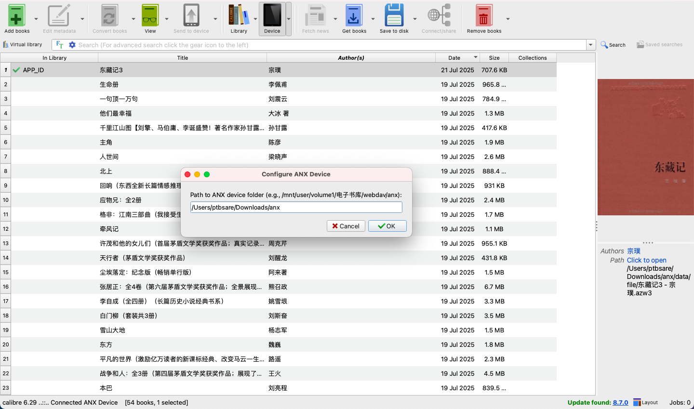

# anx-reader-calibre-plugin

[简体中文](README_zh-CN.md)

This plugin for Calibre allows you to manage your [ANX Reader](https://github.com/Anxcye/anx-reader) ebook library directly from Calibre, especially useful for NAS users who want to centralize their ebook collection on a server and synchronize it across multiple mobile clients.

## Highlights

*   **Centralized Ebook Management:** Seamlessly manage your ANX Reader ebook library stored on a NAS or server.
*   **Multi-Client Synchronization:** Facilitate synchronization of your ebook collection to multiple mobile ANX Reader clients.
*   **Powerful Metadata Editing:** Utilize Calibre's robust features to add, edit, and synchronize book metadata (including title, author, and all extended ANX DB properties) with your ANX Reader library.
*   **Flexible Library Maintenance:** Leverage [Calibre](https://calibre-ebook.com/) or [LinuxServer Calibre Docker images](https://hub.docker.com/r/linuxserver/calibre) for efficient adding, deleting, and updating of books and their metadata.

## Installation

1.  **Download the Plugin:** Obtain the `anx-reader-calibre-plugin.zip` file.
2.  **Open Calibre Preferences:** In Calibre, go to `Preferences` -> `Plugins`.
3.  **Load Plugin from file:** Click on `Load plugin from file` and select the `anx-reader-calibre-plugin.zip` file.
4.  **Restart Calibre:** Restart Calibre for the plugin to take effect.
5.  **Configure Device Path:** After restarting, go to `Preferences` -> `Plugins` -> `Device Plugins` -> `ANX Virtual Device` -> `Customize plugin`. Set the base directory where your `database7.db` and `data` folders (containing `file` and `cover` sub-folders) are located. This is typically your ANX Reader's ebook library root on your NAS/server.

## Usage

Once configured, the ANX Virtual Device will appear in Calibre's device list when connected.

*   **Add Books:** Use Calibre's "Send to Device" function to add books to your ANX Reader library. The plugin will handle copying the ebook file and its cover, and updating the ANX database.
*   **Delete Books:** Select books on the device view in Calibre and use the "Remove from Device" function. The plugin will delete the files and update the database.
*   **Edit Metadata:** Edit book metadata (title, author, and custom columns mapped to ANX DB fields) directly in Calibre's device view. Changes will be synchronized back to the ANX database.
*   **Browse Device Files:** Use `ebook-device ls /` command line tool to list files on the virtual device.

## Troubleshooting

*   **Device Not Detected:** Ensure the configured device path in the plugin settings is correct and accessible. Verify that `database7.db`, `data/file`, and `data/cover` exist within this path.
*   **Errors During Operations:** Check Calibre's debug log (`Preferences` -> `Advanced` -> `Show debug log`) for detailed error messages.

For more detailed instructions and troubleshooting, please refer to the [简体中文](README_zh-CN.md) version.