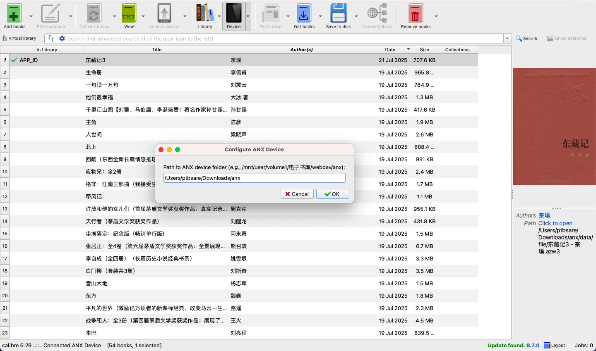

# anx-reader-calibre-plugin

[English](README.md)

这个 Calibre 插件允许您直接从 Calibre 管理您的 [ANX 阅读器](https://github.com/Anxcye/anx-reader) 电子书库，这对于希望在服务器上集中管理电子书收藏并将其同步到多个移动客户端的 NAS 用户特别有用。

## 项目亮点

*   **集中式电子书管理：** 无缝管理存储在 NAS 或服务器上的 ANX 阅读器电子书库。
*   **多客户端同步：** 促进您的电子书收藏同步到多个移动 ANX 阅读器客户端。
*   **强大的元数据编辑：** 利用 Calibre 强大的功能，添加、编辑和同步书籍元数据（包括标题、作者以及所有扩展的 ANX 数据库属性）到您的 ANX 阅读器书库。
*   **灵活的书库维护：** 利用 [Calibre](https://calibre-ebook.com/) 或 [LinuxServer Calibre Docker 镜像](https://hub.docker.com/r/linuxserver/calibre) 高效地添加、删除和更新书籍及其元数据。

## 安装指南

1.  **下载插件：** 获取 `anx-reader-calibre-plugin.zip` 文件。
2.  **打开 Calibre 首选项：** 在 Calibre 中，前往 `首选项` -> `插件`。
3.  **从文件加载插件：** 点击 `从文件加载插件` 并选择 `anx-reader-calibre-plugin.zip` 文件。
4.  **重启 Calibre：** 重启 Calibre 以使插件生效。
5.  **配置设备路径：** 重启后，前往 `首选项` -> `插件` -> `设备插件` -> `ANX 虚拟设备` -> `自定义插件`。设置您的 `database7.db` 和 `data` 文件夹（包含 `file` 和 `cover` 子文件夹）所在的根目录。这通常是您 NAS/服务器上 ANX 阅读器电子书库的根目录。

## 使用方法

配置完成后，当 ANX 虚拟设备连接时，它将显示在 Calibre 的设备列表中。

*   **添加书籍：** 使用 Calibre 的“发送到设备”功能将书籍添加到您的 ANX 阅读器书库。插件将处理电子书文件及其封面的复制，并更新 ANX 数据库。
*   **删除书籍：** 在 Calibre 的设备视图中选择书籍，然后使用“从设备删除”功能。插件将删除文件并更新数据库。
*   **编辑元数据：** 直接在 Calibre 的设备视图中编辑书籍元数据（标题、作者以及映射到 ANX 数据库字段的自定义列）。更改将同步回 ANX 数据库。
*   **浏览设备文件：** 使用命令行工具 `ebook-device ls /` 列出虚拟设备上的文件。

## 故障排除

*   **设备未检测到：** 确保插件设置中配置的设备路径正确且可访问。验证此路径中是否存在 `database7.db`、`data/file` 和 `data/cover`。
*   **操作过程中出错：** 检查 Calibre 的调试日志（`首选项` -> `高级` -> `显示调试日志`）以获取详细的错误消息。